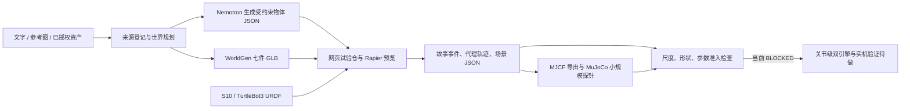

# 我的机器人分身 · WorldStage Physical Twin

我给机器人造了一间试验仓。人可以先走进去：选 S10 或 TurtleBot3 Burger 当分身，翻出宝箱里的图纸，叫出一段斜坡，安抚守门兽，再绕到黄栏后找见证者。走到出口时，系统却会拦住一句很容易脱口而出的话：「这个场景已经能拿去训练了。」

这是第三届 NVIDIA DGX Spark Agent Skills 挑战赛的 WorldStage。它把图像生成的场景、Nemotron 生成的物体、游戏里的探索，以及机器人仿真需要的来源和物理审查放进同一条流程。当前是**可运行的开发预览**；机器人训练准入仍为 `BLOCKED`。

[项目报告](docs/项目报告.md) · [验收状态](docs/验收状态.md) · [Skill Benchmark](docs/Skill-Benchmark.md) · [行为数据链路](docs/Behavior-Data-Pipeline.md) · [WorldGen 来源](worldgen-assets/README.md) · [完整方案](docs/完整方案.md)

## 先玩，再看世界是怎样来的

打开 `http://127.0.0.1:8765/lab.html`。选好分身后，沿着宝箱、斜坡、守门兽和隐藏见证者走一圈；答完尺度谜题，运行场景准入门，再选择故事结局。`/worldgen.html` 可以逐件查看试验仓中心区的七件 WorldGen 导出资产。

这七件资产来自一张室内机器人测试场参考图，保留输入图、原始导出包、逐件 GLB 的 SHA-256 与变换矩阵。浏览器从原始顶点和三角索引建立七个 Rapier 静态三角网格碰撞体，共 123308 个三角面。墙、灯、地面标识和谜题角色是项目另行制作的视觉层。网页分身则是**运动学碰撞代理**，它的路径可用于挑选测试场景，不能当作 S10 的关节动作或模仿学习的教师数据。

## 一份场景怎样流转



这里共享的是带来源的场景记录：物体尺寸和位置、视觉及碰撞资产、机器人模型、交互事件、生成方式、导出结果与未测项。它让下一步能追溯「这段坡是谁生成的」「这个尺寸有没有量过」。WorldGen 的源单位目前还没有米制标定；画面里的尺寸只按演示尺度处理。MJCF 仍使用简化碰撞形状，不能把可导出写成可训练。

## 20 个 Skill 如何接力

Skill 位于 [`demo-3d/skills/`](demo-3d/skills/)，实现和命令行入口位于 [`demo-3d/studio/`](demo-3d/studio/)。它们各自读取明确的前置产物，把输出和来源交给下一步。

| 环节 | Skill | 交出的东西 |
| --- | --- | --- |
| 定义和搭建世界 | `world-orchestrate`、`world-intake`、`world-plan`、`world-compose` | 带来源的需求、场景计划和对象图 |
| 让世界能玩 | `world-interact`、`world-narrate`、`world-verify`、`memory-puzzle-director` | 可回退交互、五条线索、故事及检查结果 |
| 放进真实资产 | `worldgen-visual-intake`、`robot-urdf-import`、`avatar-casting` | 七件源网格、URDF 身份和代理运动边界 |
| 生成并检查物理场景 | `physical-world-author`、`physics-scenario-export`、`scene-readiness-gate` | 新物体、MJCF 和阻断原因 |
| 留下运行证据 | `rollout-capture`、`nemotron-service-audit` | 带来源标签的轨迹、GX10 模型身份及推理回执 |
| 审核探索并筛选任务 | `behavior-episode-capture`、`nemotron-behavior-audit`、`sim-dataset-curation`、`behavior-benchmark` | 玩家意图与脚本运动分离、风险审查、带 SHA 的仿真任务候选与正反例评测 |

当前记录的离线 Skill 任务案例是 **20 PASS / 0 FAIL / 0 NOT_RUN**。这是指定案例的结果，包含浏览器轨迹回放和反例检查；Nemotron 行为审核的实时质量、机器人训练与三种剧情结局全量复测均不在此成绩内。复核方法见 [Skill Benchmark](docs/Skill-Benchmark.md)。

## Nemotron 在这里做什么

我们在租用的 ASUS Ascent GX10 上运行过 **NVIDIA Nemotron 3 Nano 4B GGUF**，用它把「做一段低摩擦斜坡」这类自然语言请求转成受约束的物体 JSON。网页据此增加对象，并把模型 ID、候选 SHA、字段接纳情况、耗时与来源写入回执。现在还增加了结构化探索记录审核：模型可根据停滞、碰撞热点和场景准入问题提出下一项实验，但不能批准机器人训练。行为审核的实时模型 Benchmark 尚未运行；物理参数若没有实测，仍是待验证假设。此次实测的是 4B GGUF；Nemotron Omni 尚未运行。

`demo-3d/studio/model_cli.py` 将模型操作分成五个动作：

| 命令 | 用途 |
| --- | --- |
| `serve` / `stop` | 在 GX10 本机启动和停止由该 CLI 持有的独立服务；停止前核对进程与二进制身份 |
| `doctor` | 查 `/v1/models`，可加权重和二进制 SHA 检查；API 连通本身不证明后端身份 |
| `generate` | 生成一件物体；模型未参与则报失败，除非显式允许模板 |
| `benchmark` | 依次请求斜坡、球、石柱；核对模型参与、字段接纳和物体种类 |

GX10 的独立服务完成启动、检查和停止，原有 8000 端口服务继续运行。三题生成严格成功 **3/3**，模板回退 **0**。样本很小，但体验上的变化很直观：我可以用一句话提出新障碍，再看它真的进入试验仓；不必先改场景文件。更让我放心的是，断开模型后，页面会老实标「模板」，不会把演示效果算到 Nemotron 头上。回执见 [`demo-3d/examples/gx10-nemotron/`](demo-3d/examples/gx10-nemotron/)；三题成绩只代表物体生成探针。

## 运行与复核

```bash
cd demo-3d
npm ci
npm run build
python3 studio/verify_delivery.py
python3 studio/physical_cli.py audit
python3 studio/skills_benchmark.py
python3 studio/behavior_benchmark.py
python3 studio/server.py
```

浏览器访问 `http://127.0.0.1:8765/lab.html`。仓库的 `release/worldstage-3h.zip` 也带预构建页面。连接 GX10 时，先把远端模型 API 通过 SSH 隧道映射到本机，再用设备实际返回的模型名：

```bash
python3 studio/model_cli.py doctor --base-url http://127.0.0.1:18769/v1 --model nemotron-3-nano-4b-gguf
python3 studio/model_cli.py generate '为 S10 设计一段低摩擦斜坡' --base-url http://127.0.0.1:18769/v1 --model nemotron-3-nano-4b-gguf
python3 studio/model_cli.py benchmark --base-url http://127.0.0.1:18769/v1 --model nemotron-3-nano-4b-gguf
NEMOTRON_BASE_URL=http://127.0.0.1:18769/v1 NEMOTRON_MODEL=nemotron-3-nano-4b-gguf python3 studio/behavior_benchmark.py --live --output examples/skill-benchmark/behavior_model_report.json
```

网页服务可用 `NEMOTRON_BASE_URL`、`NEMOTRON_MODEL` 指向同一个本地隧道。没有模型时可以显式使用模板，来源会写进结果；不要把模板画面当作 GX10 推理录像。

## 从游戏走向训练，还差哪一步

游戏化给了场景一个入口：观众为了找线索，会主动碰到坡、球和围栏，也会留下「哪里卡住了」的探索记录。WorldGen 让不同场地的形态更容易进入世界。以后若有米制标定、可核对碰撞体、关节级动作和真实观测，同一类场景记录可以用于仿真任务、反例筛选，并与经过授权的机器人演示结合，研究模仿学习。**当前网页轨迹只有代理位置与交互事件，没有可直接训练的关节动作标签。**

现阶段我们只做到了较小的物理探针：MuJoCo 编译并无控制步进 S10 场景 1.2 秒；一个 2 kg 落箱在 Rapier 与 MuJoCo 的接触前平均高度差为 0.00772 米。另一次 5×5 网格审计发现七件 WorldGen 源网格与 MJCF 方盒代理均有几何差异，数值单位还是展示单位。WorldGen 米制尺度、摩擦与真实接触未校准；Isaac 同场景、S10 关节控制、实机采集和 Sim2Real 收益仍为 `NOT_RUN`。所以准入门现在给出 `BLOCKED`，并列出下一步该量什么、改什么。
